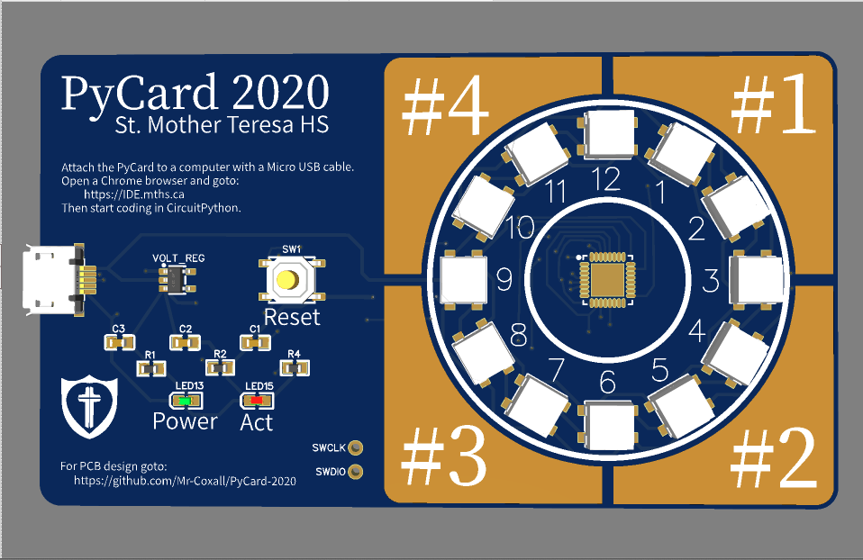

# PyCard-2020

A CircuitPython board the size of a credit card.
It has 12 NeoPixels that are arranged in a circle, like a clock.
It also have 4 touch pads around the NeoPixels.
It has an ATSAMD21 processor.

The PCB design can be found at: https://easyeda.com/patrick.coxall/pycard-2020
